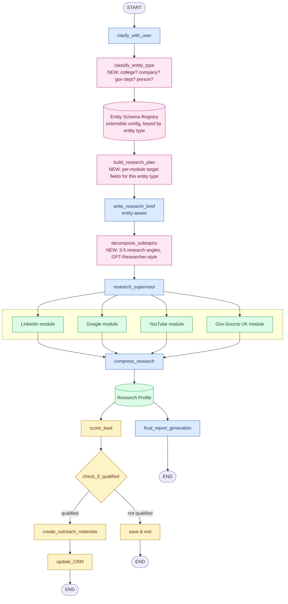
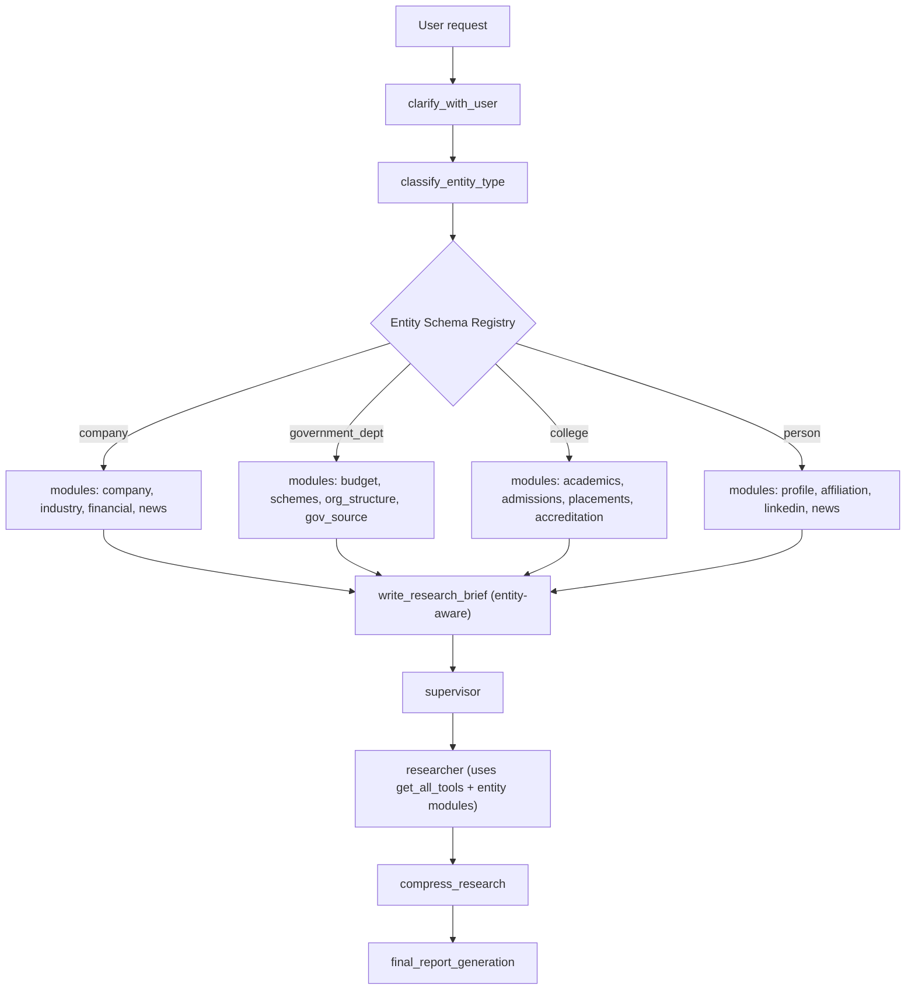

# Idea — Research + Outreach Agent Harness

## Context
PACE Uttarakhand hackathon (starts Aug 1, ~90 days). Pranav wants agents to support two things:
1. **Research** — problem research, people research, government/policy research. Needs to be a *harness*: generic, extensible, module-based, not a one-off script. We can't out-build Google Deep Research generically, but we can build a much better **Uttarakhand government policy researcher** by embedding the actual sources of truth.
2. **Outreach** — same research core should also drive sales/partnership outreach: research a person or an organization (company, college, gov dept), score them, generate personalized outreach.

## Status

| Piece | Status |
|---|---|
| Subtopic decomposition (`decompose_subtopics`) | **Done** — forces 3-5 research angles before the supervisor loop |
| Relevance-score filtering | **Done** — tuned to 0.2 against real Tavily scores (0.4 was cutting legitimate third-party sources) |
| Citation verification | **Done** — cross-checks every citation against real findings; auto-warns if it ever strips >50% (usually a corruption signal, not real hallucination) |
| Entity-type layer (`classify_entity_type` + `build_research_plan` + `entity_registry.py`) | **Done** — verified live across company/college/government_dept/person |
| Website contact-finder module (`website_contact_finder`) | **Done** — crawls an org's own site for named people/contact info via Tavily `.crawl()`; honestly reports "not found" rather than fabricating |
| News search steering | **Done** — researcher now told to use `topic="news"` for news-shaped targets |
| Free-tier fallback model | **Done** — every model call falls back to Gemma if the primary is rate-limited |
| Sales outreach content (email/report/scoring prompts) | **Done** — rewritten from kaymen99's generic "ElevateAI" demo content to real PACE Uttarakhand partner-track pitches |
| Gmail OAuth | **Done** — `credentials.json`/`token.json` working, gitignored |
| Sales graph trim (drop kaymen99's own research nodes, wire in shared research core) | **Done** — verified end-to-end live (research → sufficiency gate with 1 retry → scoring → real Google Doc report → personalized email → Gmail draft → CRM write-back) |
| Contact-finder module (`website_contact_finder`) | **Done** — crawls an org's own site, verified twice; note: this is *not* LinkedIn, that's still unbuilt |
| Research sufficiency gate (retry once, then flag `NEEDS_MORE_RESEARCH` rather than pitch on thin data) | **Done** |
| Unit test suite (pure functions, no API cost) | **Done** — 30 tests across both repos (`tests/unit/`, `src/sales_outreach/tests/`) |
| LinkedIn module (`linkedin_search`) | **Done** — self-hosted (`joeyism/linkedin_scraper` + several stale-selector patches we had to write ourselves), verified live: name/location/about/experience/education extraction all correct on a real profile |
| YouTube module (`youtube_search`) | **Done** — official YouTube Data API, verified live (channel info + recent videos, picks the right channel by subscriber count, not just first search hit) |
| Social/blog link discovery | **Done** — folded into `website_contact_finder`'s existing crawl rather than a separate tool |
| Person-level research in the sales pipeline | **Done** — `run_shared_research` now researches the named lead, not just their company |
| Twitter/X, Facebook/Instagram data-fetching | **Explicitly skipped** — investigated directly: X has no free API tier as of 2026 and open-source scrapers are described as breaking on every frontend update; Facebook/Instagram scraping is both heavily detected and against ToS. Not worth the ongoing maintenance burden. |
| Multi-retriever aggregation (Google CSE) | Not started — have the API key, need a Custom Search Engine ID (`cx`) |
| `tavily.crawl()` for known URLs beyond contact-finding | Not started |
| Curated Uttarakhand RSS news module | Not started — needs actual feed URLs, blocked on having them |
| **The actual Uttarakhand/gov source-of-truth embedding (the real differentiator)** | **Not started** — still the highest-leverage unbuilt piece; neither donor repo has any India/gov-specific knowledge; this is what this doc's own Context section (above) names as the actual goal, not the generic infrastructure |
| Evaluation/benchmark set | Not started |
| Cross-run memory / dedup | Not started |

## Base repos (skeleton donors, not forks to maintain long-term)
- **[open_deep_research](https://github.com/langchain-ai/open_deep_research)** — LangGraph-native research harness. Donates: `clarify_with_user`, `write_research_brief`, `research_supervisor`, parallel researcher subagents, `compress_research`, `final_report_generation`. Verified extensible via `get_all_tools()` + MCP — new modules are just one `@tool` function + one line registration.
- **[sales-outreach-automation-langgraph](https://github.com/kaymen99/sales-outreach-automation-langgraph)** — donates the outreach layer: `score_lead`, `check_if_qualified`, `create_outreach_materials`, `generate_personalized_email`, `generate_interview_script`, `update_CRM`.

Both are the same underlying shape (LangGraph state graph + pluggable tool modules feeding an LLM synthesis step) — that's why they merge cleanly into one harness with two exit paths instead of being separate products.

Rejected/reference-only:
- `yerdaulet-damir/langgraph-sales-agent` — different product category (live-chat commerce bot across Telegram/Instagram/WhatsApp/Web), no research phase, not compatible.
- `guy-hartstein/company-research-agent` — actively maintained, useful as a technique reference for research quality, not used as a base repo.

## Module structure
Research splits into categories, each category splits into source-specific modules (one `@tool` function each, independently addable/improvable):

- `people_research` → linkedin, google, youtube, twitter/x, github, news
- `org_research` → google (shared), gov_source (Uttarakhand-specific), news (shared), website
- `problem_research` → gov_source (shared), existing_solutions, news (shared)

## Entity-type layer — implemented and verified

Gap this solves: a college and a company both hit `google_module` + `gov_source_module`, but need *different fields* — a college needs accreditation/placement/registrar contact, a company needs revenue/decision-maker/industry. So classification isn't enough; each entity type needs its own **target schema** telling each module what to actually look for.

Built as: `entity_registry.py` (plain Python dict) → `classify_entity_type` node → `build_research_plan` node (per-module target fields for this entity) → feeds `write_research_brief`, wired exactly as diagrammed below. `classify_entity_type` runs right after `clarify_with_user`, before `write_research_brief` — by then the subject is settled, and classifying first lets the brief itself be entity-aware instead of writing a generic brief and specializing afterward.

Verified with live model calls across all 4 types: "Uttarakhand Forest Department" → `government_dept`, "IIT Roorkee" → `college`, "Satya Nadella" → `person`, "OpsHub company" → `company` — each correctly classified and produced entity-specific guidance fed into the brief. `company`'s targets were aligned to `company-research-agent`'s proven 4-category split (company/industry/financial/news) rather than invented from scratch.

Adding a new entity type later (NGO, research institute, etc.) = one new block in the registry config. No graph or module changes required — that's the scalability point. Not yet built: dedicated per-entity tool modules beyond the website contact-finder (LinkedIn, gov_source) - this layer currently steers the *existing* search tools toward the right targets.

## Full architecture



Legend: blue = from `open_deep_research`, yellow = from `kaymen99` sales repo, green = shared modules/objects, pink = new entity-type layer we're adding.

`decompose_subtopics` isn't part of the entity-type layer — it's a GPT-Researcher-derived efficiency improvement (forces breadth before delegating to the supervisor) landing first, ahead of the entity-type work below.

## Entity/module structure — how classification feeds modules



## Entity Schema Registry — example shape

```yaml
college:
  modules: [google, gov_source, linkedin]
  targets:
    google: ["official website", "NAAC/NBA accreditation", "placement record"]
    gov_source: ["UGC/AICTE listing", "affiliated university"]
    linkedin: ["registrar", "principal", "placement officer"]

company:
  modules: [google, linkedin, news]
  targets:
    google: ["industry", "revenue signal", "recent funding"]
    linkedin: ["decision maker", "company size", "recent hires"]
    news: ["recent press", "expansion/contraction signals"]

government_dept:
  modules: [gov_source, news]
  targets:
    gov_source: ["mandate", "budget", "schemes run", "key officials"]
    news: ["recent announcements", "public complaints/press"]
```

## What's reused vs. what we build
- **Reused as-is**: everything blue + yellow above (both donor repos' core nodes)
- **We write**: the module `@tool` functions (linkedin, google, youtube, gov_source), the Entity Schema Registry + `classify_entity_type` + `build_research_plan` nodes, and the branch point after `compress_research` (report path vs. outreach path)

## Open questions / not yet decided
- Exact repo layout (monorepo structure) — not scaffolded yet, was intentionally deferred until architecture was agreed
- ~~Where the Entity Schema Registry configs live~~ — **decided**: plain Python dict (`entity_registry.py`), fastest to build; portable to YAML later if a non-engineer needs to edit it directly
