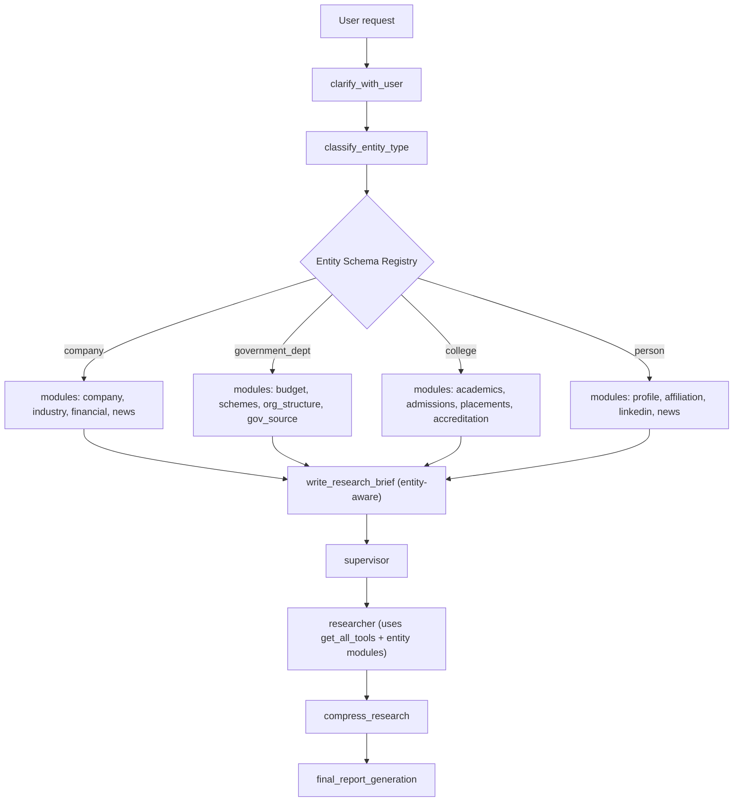

# Idea — Research + Outreach Agent Harness

## Context
PACE Uttarakhand hackathon (starts Aug 1, ~90 days). Pranav wants agents to support two things:
1. **Research** — problem research, people research, government/policy research. Needs to be a *harness*: generic, extensible, module-based, not a one-off script. We can't out-build Google Deep Research generically, but we can build a much better **Uttarakhand government policy researcher** by embedding the actual sources of truth.
2. **Outreach** — same research core should also drive sales/partnership outreach: research a person or an organization (company, college, gov dept), score them, generate personalized outreach.

## Base repos (skeleton donors, not forks to maintain long-term)
- **[open_deep_research](https://github.com/langchain-ai/open_deep_research)** — LangGraph-native research harness. Donates: `clarify_with_user`, `write_research_brief`, `research_supervisor`, parallel researcher subagents, `compress_research`, `final_report_generation`. Verified extensible via `get_all_tools()` + MCP — new modules are just one `@tool` function + one line registration.
- **[sales-outreach-automation-langgraph](https://github.com/kaymen99/sales-outreach-automation-langgraph)** — donates the outreach layer: `score_lead`, `check_if_qualified`, `create_outreach_materials`, `generate_personalized_email`, `generate_interview_script`, `update_CRM`.

Both are the same underlying shape (LangGraph state graph + pluggable tool modules feeding an LLM synthesis step) — that's why they merge cleanly into one harness with two exit paths instead of being separate products.

Rejected/reference-only:
- `yerdaulet-damir/langgraph-sales-agent` — different product category (live-chat commerce bot across Telegram/Instagram/WhatsApp/Web), no research phase, not compatible.
- `guy-hartstein/company-research-agent` — actively maintained, useful as a technique reference for research quality, not used as a base repo.

## Module structure
Research splits into categories, each category splits into source-specific modules (one `@tool` function each, independently addable/improvable):

- `people_research` → linkedin, google, youtube, twitter/x, github, news
- `org_research` → google (shared), gov_source (Uttarakhand-specific), news (shared), website
- `problem_research` → gov_source (shared), existing_solutions, news (shared)

## Entity-type layer (the new piece)
Gap: a college and a company both hit `google_module` + `gov_source_module`, but need *different fields* — a college needs accreditation/placement/registrar contact, a company needs revenue/decision-maker/industry. So classification isn't enough; each entity type needs its own **target schema** telling each module what to actually look for.

New nodes: `classify_entity_type` → looks up an **Entity Schema Registry** (plain config, not code) → `build_research_plan` (per-module target fields for this entity) → feeds the existing `research_supervisor`.

`classify_entity_type` runs right after `clarify_with_user`, before `write_research_brief` — by then the subject is settled (clarification is done), and classifying first lets the brief itself be entity-aware (a `government_dept` brief asks for budget/schemes/org structure, a `company` brief asks for funding/product/market) instead of writing a generic brief and only specializing afterward.

Adding a new entity type later (NGO, research institute, etc.) = one new block in the registry config. No graph or module changes required — that's the scalability point.

## Full architecture


Legend: blue = from `open_deep_research`, yellow = from `kaymen99` sales repo, green = shared modules/objects, pink = new entity-type layer we're adding.

`decompose_subtopics` isn't part of the entity-type layer — it's a GPT-Researcher-derived efficiency improvement (forces breadth before delegating to the supervisor) landing first, ahead of the entity-type work below.

## Entity/module structure — how classification feeds modules



## Entity Schema Registry — example shape

```yaml
college:
  modules: [google, gov_source, linkedin]
  targets:
    google: ["official website", "NAAC/NBA accreditation", "placement record"]
    gov_source: ["UGC/AICTE listing", "affiliated university"]
    linkedin: ["registrar", "principal", "placement officer"]

company:
  modules: [google, linkedin, news]
  targets:
    google: ["industry", "revenue signal", "recent funding"]
    linkedin: ["decision maker", "company size", "recent hires"]
    news: ["recent press", "expansion/contraction signals"]

government_dept:
  modules: [gov_source, news]
  targets:
    gov_source: ["mandate", "budget", "schemes run", "key officials"]
    news: ["recent announcements", "public complaints/press"]
```

## What's reused vs. what we build
- **Reused as-is**: everything blue + yellow above (both donor repos' core nodes)
- **We write**: the module `@tool` functions (linkedin, google, youtube, gov_source), the Entity Schema Registry + `classify_entity_type` + `build_research_plan` nodes, and the branch point after `compress_research` (report path vs. outreach path)

## Open questions / not yet decided
- Exact repo layout (monorepo structure) — not scaffolded yet, was intentionally deferred until architecture was agreed
- Where the Entity Schema Registry configs live (yaml files vs. Python dict vs. DB) — leaning config file for easy non-engineer edits later
