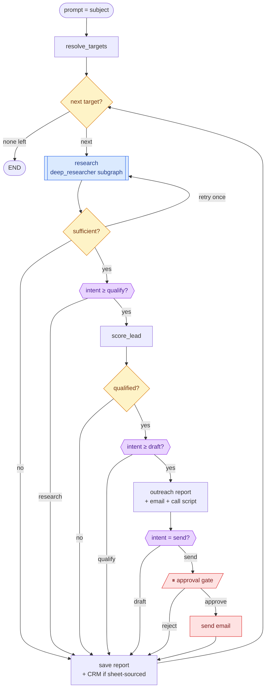
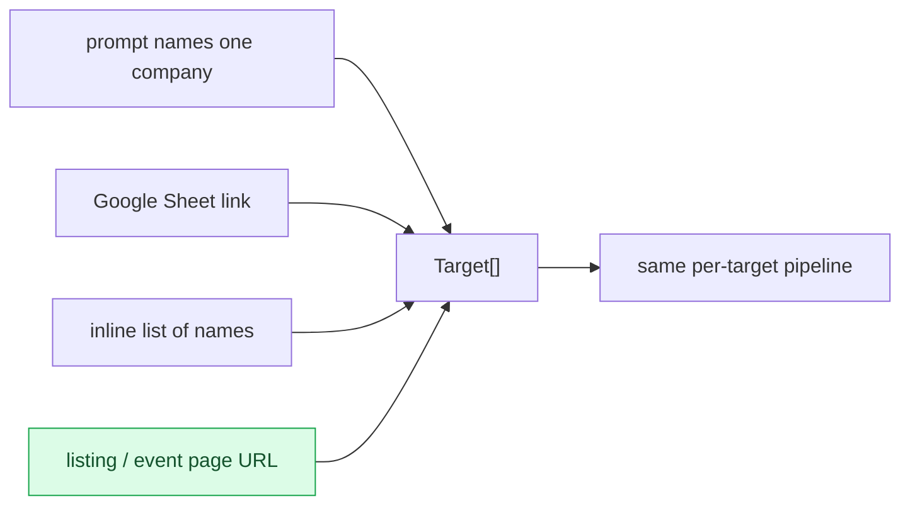

# Design — Unified Agent (research + outreach, one system)

**Status:** implemented (`src/agent/`)
**Date:** 2026-07-31

## Problem

Research and outreach currently work as one pipeline at runtime — `run_shared_research`
calls `deep_researcher.ainvoke()`, and an end-to-end run genuinely flows research → score →
materials → Gmail draft → CRM. But structurally they are two compiled graphs, so:

- LangGraph Studio shows two separate entries; you pick one up front
- The research phase collapses into one opaque node inside a sales trace
- Choosing "research only" vs "research + outreach" means choosing a *graph*, not stating
  an intent
- There is no way to say "here is a page / a sheet / a list — go work through all of it"

## Goals

1. One entry point and one graph, with research nested as a visible subgraph
2. The user picks **how deep to go** (research → qualify → draft → send) explicitly
3. One target or many, from four different input shapes, through the same loop
4. Research stays independently runnable and unchanged
5. A single target behaves exactly as it does today — no regression

## Non-goals

Gov-source module, Uttarakhand knowledge embedding, changes to research internals, new
outreach copy. This is orchestration only.

## Architecture



Purple gates are config reads, not LLM calls. Intent was deliberately **not** inferred from
the prompt: a classifier misreading "send" puts real email in a real prospect's inbox.

## Intents

Intents nest — each is the same pipeline stopping deeper.

| Intent | Stops after | Use |
|---|---|---|
| `research` | report | Just learn about a subject |
| `qualify` | score | Triage a long list cheaply before writing to anyone |
| `draft` | Gmail draft | Normal outreach preparation |
| `send` | sent email | Outreach, gated by approval |

`intent` is a single enum on `AgentConfiguration`, rendering as a dropdown in Studio via the
same `x_oap_ui_config` mechanism the existing config fields use. Default is `research` — the
only intent with no outward-facing side effects.

`send` replaces the existing `send_email_directly` bool, which disappears.

**Approval gate.** `send` pauses on a LangGraph `interrupt()` showing recipient and body
before sending. Controlled by `require_send_approval` (default `True`). Rationale: selecting
`send` is genuine authorization, but in batch mode one toggle otherwise fires N real emails
unattended. Turn it off once the output is trusted.

## Target resolution



```python
Target(name, website=None, email=None, context=None,
       source: "prompt"|"sheet"|"inline"|"page", crm_row_id=None)
```

`Target` is **orchestration only** — what to process, where it came from, and what we already
know. It deliberately carries **no kind/type field**: the research core already classifies
subjects via `classify_entity_type` into `company / college / government_dept / person /
general`, and returns `entity_type` in its result. Duplicating that here would mean two
sources of truth that can disagree.

- `crm_row_id` is set only for sheet-sourced targets — **CRM write-back is skipped for every
  other source**, because an inline-typed name has no row to update. This distinction does
  not exist today and would silently misbehave.
- `context` carries free-form seed facts scraped from the source, e.g.
  `"CIO, Mahindra Group — speaker, ETCIO Annual Conclave 2025"`. These are appended to the
  research query so research does not have to rediscover what the page already told us. They
  are hints, not classification.

**Person targets.** A target may be a person rather than an organization. Nothing pre-declares
this — it falls out of the research core's own classification:

- **Scoring** branches on the `entity_type` returned by research. For `person`, scoring
  evaluates the *employer's* partnership fit, since `SCORE_LEAD_PROMPT` assesses company
  partner-track fit and is meaningless applied to an individual
- **Outreach** is addressed to the person, since that is the point of extracting them; if no
  email is known, they go through the same contact-finding path as any other target
- **Research** already handles them: the `person` entity type pursues role, background and
  public profile

### Listing-page extraction

Verified against `cio.economictimes.indiatimes.com/annual-conclave2025` with a real Tavily
crawl. Findings:

- **Named people extract reliably**, with title and company
  (e.g. `Rucha Nanavati — CIO, Mahindra Group`)
- **Event contact details extract reliably**
  (e.g. partnership contact with email and phone)
- **Sponsor company names extract only partially** — logos are images; names are recoverable
  only where alt text exists (`Image 11: Adobe` yes, `Image 18` no). Tier headings
  ("Presenting Partner", "Platinum Partners") extract fine
- The requested 2025 URL returned sibling-year pages, suggesting it is JS-rendered

Mitigation: **crawl plus search**. Alongside the crawl, run a `tavily_search` for the event's
sponsor list — press coverage frequently lists sponsors as plain text, recovering names the
logos hide. Both organizations and named people become targets (people already carry
title + company, so they skip the "find a contact" step).

Partial extraction is acceptable and expected. The design must not assume a complete list.

## Components

```
src/agent/                 NEW - orchestration only
  configuration.py         AgentConfiguration: intent, require_send_approval, max_targets
  state.py                 AgentState: targets, current_target, per-target results
  targets.py               resolve_targets across the four sources
  graph.py                 unified graph + intent gates

src/open_deep_research/    unchanged, still independently runnable
src/sales_outreach/        nodes unchanged, imported as a library
```

All real work stays in the existing packages. `src/agent/` decides only what to process,
how deep to go, and when to stop.

## State

Per-target state is reset explicitly between targets, guarded by a test that enumerates
state fields and fails when a new one is added without a reset — the same failure mode that
previously leaked one lead's reports and report link into the next.

**Reuse over re-derivation.** Values the research core already produces are read from its
result, not recomputed in the orchestrator:

| Value | Source |
|---|---|
| `entity_type` | returned by research (`classify_entity_type`) — drives scoring branch |
| `final_report` | returned by research — feeds sufficiency, scoring, all materials |
| `research_brief`, `notes` | available if needed; not currently consumed by sales |

The orchestrator adds only what genuinely does not exist yet: the target list, which target
is current, and how deep the intent says to go.

**Resolved during implementation** (was an open question in the approved design):

- **Native subgraph nesting works** with partial key overlap. A parent declaring only
  `messages`/`final_report`/`entity_type` can do `add_node("research", deep_researcher)`;
  the subgraph's undeclared keys (`notes`, `research_brief`) drop cleanly and parent-only
  keys survive. The wrapper-call fallback was not needed.
- **The subgraph echoes `messages` back to the parent.** With an appending reducer the
  parent accumulates duplicates on every target, so the parent's `messages` uses a
  *replacing* reducer.
- **A replacing reducer does not coerce input shapes.** `add_messages` normally turns
  `("user", "text")` tuples and `{"role":..., "content":...}` dicts into Message objects;
  a replacing reducer leaves them raw, so `_prompt_text` reads all three shapes directly.
- **The graph is built by a factory**, `build_unified_agent(research_node=deep_researcher)`.
  A compiled subgraph is bound at construction, so patching the module attribute afterwards
  cannot reach it; the parameter lets tests substitute a stub instead of spending quota.

## Error handling

| Failure | Behavior |
|---|---|
| Bad sheet link / empty extraction | Fail loudly at `resolve_targets`; never silently process zero targets |
| Research insufficient | Existing: one gap-focused retry, then flag `NEEDS_MORE_RESEARCH` |
| One target errors mid-batch | Record and continue — one bad target must not abort the rest |
| Approval rejected | Keep the draft, mark rejected, continue |
| Rate limit | Existing Gemma fallback |
| `max_targets` exceeded | Refuse up front rather than discovering it after burning quota |

## Testing

- **Pure unit** — intent gate logic, sheet-URL extraction, inline-list parsing, `Target`
  construction, listing-page parsing against a saved fixture of the crawl above
- **Structural** — all four intent depths reachable; approval gate present only on the send
  path; CRM skipped for non-sheet sources
- **Regression** — per-target state reset guard
- **End-to-end with mocked research** — one run per intent, asserting each stops at the
  correct depth and produces exactly the expected artifacts
- **No-regression** — a sheet-sourced run at `intent=draft` produces the same artifacts and
  the same CRM write-back as the current sales graph does today. (This is the precise
  equivalent of today's behavior; "prompt names one company" is a new path with no prior
  behavior to preserve.)

## Documentation deliverable

`src/sales_outreach/docs/system-workflow.md` is rewritten to describe the real current
pipeline with PACE context. It was deleted during the refactor because it documented nodes
that no longer exist; the correct fix was to rewrite it, not remove it.

## Risks

1. **Listing-page extraction is inherently partial.** Sponsor logos without alt text are not
   recoverable by text crawling. Search fallback reduces but does not eliminate this.
2. **Batch quota.** N targets × two research passes each is significant on a free tier that
   has repeatedly rate-limited during development. `max_targets` and the `qualify` intent
   (triage before generating materials) are the mitigations.
3. **Subgraph state mapping** — see open question above; resolved by testing first.
