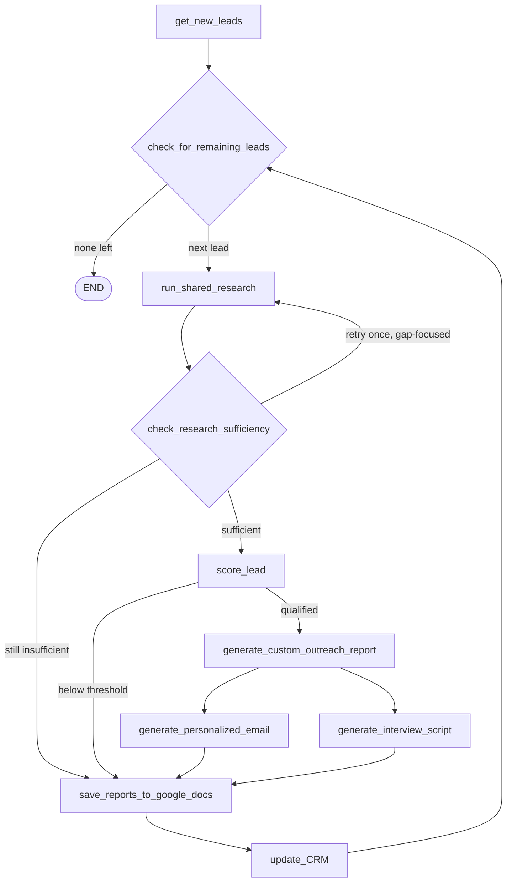

# System Workflow

How the sales outreach graph actually works today, node by node. For the wider project
architecture see [`docs/idea.md`](../../../docs/idea.md); for the planned unification with
research see [`docs/unified-agent-design.md`](../../../docs/unified-agent-design.md).

All research is delegated to the shared `open_deep_research` core. This graph owns only the
sales-specific work.

## What this system is selling

Outreach pitches **PACE Uttarakhand** — a 90-day open-innovation programme that connects real
problems from Uttarakhand's departments, institutions and companies with builder teams who
produce working, evidence-backed solutions. Companies are approached for one of three partner
tracks:

- **Technology Partner** — cloud credits, APIs, tools, or engineering support for builders
- **Hiring Partner** — consent-based access to builders evaluated on demonstrated work
- **Challenge / Pilot Partner** — bring a real operational problem, get multiple independently
  built solutions, with a possible route to a pilot

This description lives once in `prompts.py` as `PACE_UTTARAKHAND_CONTEXT` and is shared by the
scoring, report, email and call-script prompts, so the pitch cannot drift between them.

## Flow

## Nodes

**`get_new_leads`** — loads leads from the source named by `lead_loader_type`
(Google Sheets / Airtable / HubSpot). The loader is built lazily from config, so the graph
itself takes no constructor arguments and can be exposed directly in `langgraph.json`.

**`check_for_remaining_leads`** — loop head. Pops the next lead and returns the shortened
queue in the state update rather than mutating state in place, which would be lost under a
checkpointer.

**`run_shared_research`** — calls the `open_deep_research` graph, twice when a lead name is
known: once for the person (role, background, LinkedIn) and once for their company. The
parent config is merged rather than replaced so runtime model and search settings reach the
research core. On a retry, the query is steered at the specific gap the sufficiency check
identified instead of repeating the same request.

**`check_research_sufficiency`** — the quality gate. Judges whether the research has enough
real substance to write a credible pitch. This exists to prevent both failure modes at either
extreme: duplicating research work here, and generating a weak, generic email from thin data.
One gap-focused retry is allowed (`max_research_retries`), then the lead is flagged
`NEEDS_MORE_RESEARCH` rather than pitched to.

**`score_lead`** — scores partnership fit against the three tracks. Qualification is recorded
explicitly in state, not inferred later from whether a Google Docs link exists — that
inference mislabels qualified leads whenever Docs saving is off.

**`generate_custom_outreach_report`** — writes and proofreads the outreach report, then fans
out to both material generators in parallel.

**`generate_personalized_email`** — writes the email and creates a **Gmail draft**. Sending is
gated behind `send_email_directly`, which defaults off so a bad generation can never
auto-send to a real prospect.

**`generate_interview_script`** — SPIN questions plus a partnership call script.

**`save_reports_to_google_docs`** — the fan-in point for both generators, and the persistence
step. Reports always save locally; Google Docs only when `save_to_google_docs` is on.

**`update_CRM`** — writes status, score and links back, then resets every per-lead field.
Status reflects where the lead actually stopped: `NEEDS_MORE_RESEARCH`, `NOT_QUALIFIED`, or
`ATTEMPTED_TO_CONTACT`.

## Routing

There are no `add_conditional_edges`. Every node returns `Command(goto=...)`, matching
`open_deep_research`. The only declared edge is `START → get_new_leads`.

Fan-out and fan-in both work through `Command`: `generate_custom_outreach_report` returns a
list of targets, and both generators return the same next node. LangGraph's per-node trigger
channels tolerate multiple writes in one superstep, so the join runs exactly once.

## State reset between leads

The graph reuses one state object across leads, so **every per-lead field must be reset in
`update_CRM`**. Reports use an `override_reducer` because a plain `add` reducer cannot be
cleared by assignment — that previously leaked one lead's reports into the next lead's prompts
and documents. A test enumerates the state fields and fails if a new one is added without a
reset.

## Configuration

Everything behavioural lives in `SalesConfiguration` (`configuration.py`), resolved from
environment variables first, then the runtime `configurable` dict, then defaults. Field names
are prefixed where they would otherwise collide with the research core's config, since both
resolve from the same environment namespace.

## Reaching this pipeline through the unified agent

This graph remains runnable on its own (batch over a lead sheet, via `main.py` or the
**Sales Outreach** entry in Studio). The same sales work is also reachable through the
**Unified Agent** (`src/agent/`), which adds a layer in front:

- The **prompt** names the subject — one company, a pasted Google Sheet link, an inline list
  of names, or an event/listing page URL to extract organizations and people from
- The **`intent` config** decides how deep to go: `research` → `qualify` → `draft` → `send`,
  each running the same pipeline and stopping deeper

Two differences worth knowing when running through the unified agent:

- **CRM write-back only happens for sheet-sourced targets.** An inline-typed name or a name
  scraped from a page has no row to update.
- **Sending pauses for approval** by default (`require_send_approval`), rather than relying on
  the `send_email_directly` flag used by this graph directly.

See [`docs/unified-agent-design.md`](../../../docs/unified-agent-design.md).
